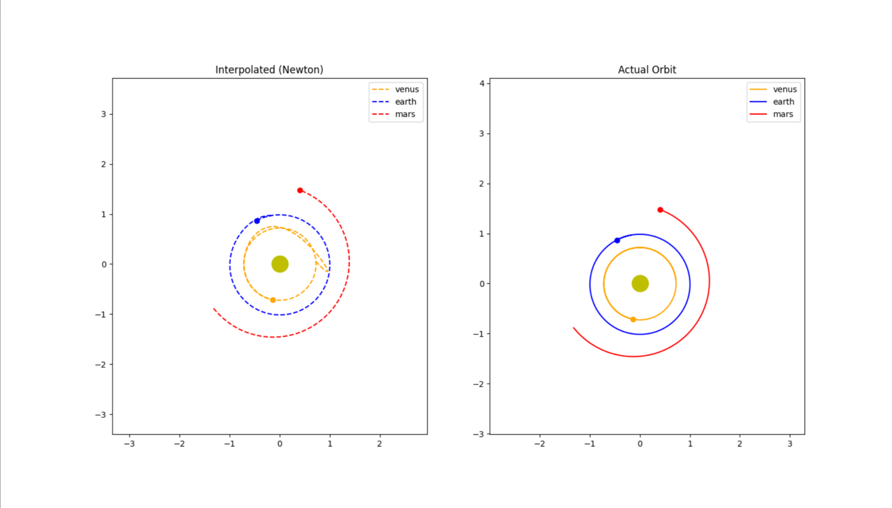

This project investigates the accuracy of Newton’s interpolation method for approximating planetary orbital data.

It uses Newton’s forward interpolation to estimate the positions of planets in a 2D plane based on discrete observational data. The dataset contains position coordinates (x_au, y_au) over time for multiple planets.

### Approach
* The dataset is processed to extract planetary motion data for each planet.
* Each planet’s trajectory consists of 687 samples, representing one Martian year.
### To construct the interpolation model:
* Every 50th data point is selected as a subset of known samples.
* A divided difference table is generated using these sampled points.
* Newton’s forward interpolation is applied to estimate positions at all intermediate time steps.
* For comparison, Cubic Spline interpolation is also applied to the same sampled data.
* The interpolated results are compared against the original dataset to compute approximation errors.
### Visualization
* The project uses matplotlib to animate and visualize:
* Planetary orbits reconstructed using Newton interpolation
* Actual planetary trajectories from the dataset
* The animation highlights differences between the interpolated and actual orbits in real time.

### Goal

To evaluate how well Newton’s interpolation method approximates continuous orbital motion from sparsely sampled discrete data, and to compare its accuracy against spline-based interpolation.

